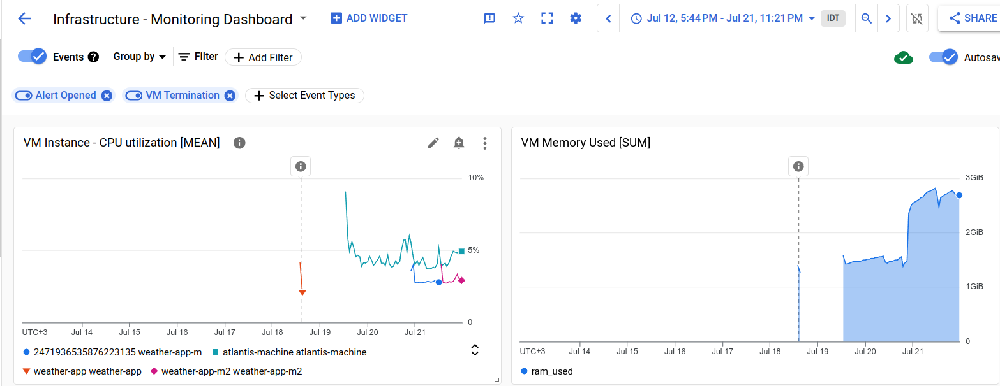
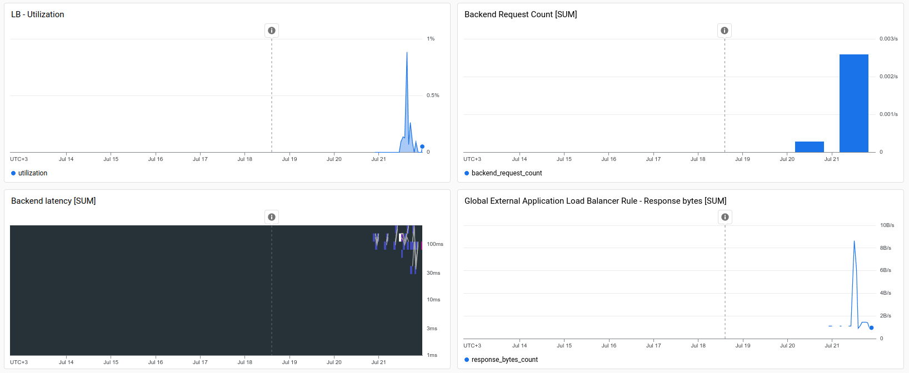

# Infrastructure GitOps Project

## Overview

This repository contains the Terraform code and configuration for deploying and managing infrastructure using Google Cloud Platform (GCP). The project uses Atlantis for GitOps automation and integrates with GitLab CI/CD for continuous integration and deployment.

## How to Use the Terraform Repo with Atlantis

### Prerequisites

- **Clone the Repository**:

  - Clone the repository to your local machine:

    ```
    git clone <repository-url>
    cd <repository-name>
    ```

### Steps to Configure GitLab Webhook

1. **Navigate to Webhooks**:

   - Go to your GitLab repository.
   - Click on **Settings** > **Webhooks**.

2. **Add a Webhook**:
   - **URL**: Enter the URL of your Atlantis server:
     ```
     http://<atlantis-server-url>/events
     ```
   - **Secret Token**: Enter a secret token for authentication.
   - **Trigger Events**: Select **Merge Request events**, **Push events**, and **Note events**.
   - **SSL Verification**: Enable if using SSL.
   - Click **Add webhook** to save.

### Setting Up Atlantis

**_set up in your vm instance_**

1. **Enter Credentials into HashiCorp Vault**:

   - Follow the instuctions and install Hashicorp vault:
     https://developer.hashicorp.com/vault/tutorials/getting-started/getting-started-install

   - Run the vault server:
     https://developer.hashicorp.com/vault/tutorials/getting-started/getting-started-dev-server

   - Store your Gitlab credentials and other sensitive information in HashiCorp Vault. For example:

     ```sh
     vault kv put secret/atlantis gh_user=your-github-username gh_token=your-github-token
     ```

   - Store the requried variables for atlantis configuration:
     **ATLANTIS_GH_USER** = gitlab username.
     **ATLANTIS_GH_TOKEN** = gitlab token.
     **ATLANTIS_REPO_ALLOWLIST** = repositories it will accept webhooks from.
     **ATLANTIS_GITLAB_TOKEN** = same gitlab token.
     **ATLANTIS_GITLAB_WEBHOOK_SECRET** = gitlab webhook secret string.
     **GOOGLE_APPLICATION_CREDENTIALS** = google credentials file path.

2. **Install Docker and Docker Compose**:

   - https://docs.docker.com/engine/install/ubuntu/

3. **Run the Setup Script**:

   - The setup script `start_atlantis.sh` is provided in the repository. This script will fetch the secrets from HashiCorp Vault and start Atlantis in a container.

     ```sh
     ./start_atlantis.sh
     ```

## Changing the Atlantis Configuration

The Atlantis configuration for your project is managed through the `atlantis.yaml` file. This file allows you to define how Atlantis should handle Terraform pull requests, specify workflows, define projects, and customize commands.

### `atlantis.yaml` Overview

The `atlantis.yaml` file is located in the root of your repository. Here is an example of what the file might look like:

```yaml
version: 3
projects:
- name: project-name
   dir: .
   workspace: default
   workflow: custom
   autoplan:
      when_modified: ["*.tf", "*.tfvars"]
      enabled: true
workflows:
custom:
   plan:
      steps:
      - init
      - plan
   apply:
      steps:
      - run: <use to run a command>
      - apply
```

- **_Key Sections_**

1. **version**: Specifies the version of the `atlantis.yaml` file format. Use `version: 3` for the latest version.

2. **projects**: Defines the Terraform projects that Atlantis will manage. Each project can have the following attributes:

   - **name**: A unique identifier for the project.
   - **dir**: The directory containing the Terraform configuration for this project.
   - **workspace**: The Terraform workspace to use.
   - **workflow**: Specifies which workflow to use for this project.
   - **autoplan**: Configuration for automatic planning. The `when_modified` attribute specifies which files should trigger a plan, and `enabled` enables or disables autoplan.

3. **workflows**: Defines custom workflows for Atlantis to use. Workflows consist of `plan` and `apply` steps:
   - **steps**: Each step can be a `run` command to execute a specific Terraform command or script.

### Workflow with Atlantis and GitLab CI/CD

1. **Feature Branch Development**:

   - Create a new branch for your feature or change.
   - Make your infrastructure changes in this branch.

     ```sh
     git checkout -b feature-branch
     ```

2. **Push Changes to GitLab**:

   - Push your feature branch to GitLab.

     ```sh
     git add .
     git commit -m "Describe your changes"
     git push origin feature-branch
     ```

3. **Create a Merge Request**:

   - Create a merge request from your feature branch to the `main` branch in GitLab.
   - Atlantis will automatically detect the merge request and add a comment with the Terraform plan.

4. **Review the Plan**:

   - Review the plan generated by Atlantis in the merge request comments.

5. **Approve the Merge Request**:

   - Approve the merge request to allow Atlantis to proceed with applying the changes.

6. **Apply the Changes**:

   - Comment `atlantis apply` on the merge request to instruct Atlantis to apply the changes.

     ```plaintext
     atlantis apply
     ```

7. **Atlantis Applies the Changes**:

   - Atlantis will apply the changes using `terraform apply`, running the GitLab CI pipeline if configured, and then comment when it's done.

8. **Auto-Merge the Changes**:
   - After successfully applying the changes, Atlantis will automatically merge the feature branch into the `main` branch.

## GitOps Workflow

### Atlantis and GitLab CI/CD Integration

- **Atlantis**:

  - Atlantis is a tool that facilitates GitOps for Terraform, enabling teams to automate Terraform workflows based on Git events.
  - Automates Terraform workflows by creating plans and applying changes based on GitLab merge requests.
  - Configured to wait for approval before applying changes and automatically merge changes after successful application.

- **GitLab CI/CD**:
  - Used for continuous integration and deployment, running tests, and ensuring code quality before merging.

### How Atlantis works

- **Webhook Configuration**:

  - Webhook Setup: A webhook is set up in your GitLab repository to notify Atlantis of events such as merge request creation, updates, and comments.
  - Event Handling: When a webhook event occurs (e.g., a merge request is created), GitLab sends an HTTP POST request to the Atlantis server.

- **Event Processing**:

  - Event Detection: Atlantis detects the event and extracts necessary information such as the repository URL, branch name, and commit SHA.
  - Repository Cloning: Atlantis clones the repository to its local workspace using the provided Git credentials.

- **Plan Creation**:

  - Terraform Plan: Atlantis runs terraform plan to create an execution plan that shows what changes will be made to the infrastructure.
  - Plan Output: The output of the plan is posted as a comment on the merge request for team members to review.

### Workflow Steps

1. **Feature Branch Development**:

   - Developers create feature branches for new changes.

2. **Merge Request Creation**:

   - Merge requests are created to merge feature branches into the main branch.
   - Atlantis triggers a Terraform plan to preview infrastructure changes.

3. **Review and Approval**:
   - Merge requests are reviewed and approved by team members.
   - Upon approval, a team member comments atlantis apply to apply the changes.
   - Atlantis applies the changes and merges the pull request.

## Monitoring Setup and Chosen Metrics

Monitoring is an integral part of this project to ensure the health, performance, and reliability of the infrastructure and applications. We have integrated several monitoring tools and configured key metrics to provide comprehensive insights.

### Google Cloud Monitoring

We utilize Google Cloud's Monitoring service for monitoring various aspects of the infrastructure. This includes VM instances, load balancers, and other critical resources.

### Key Metrics

1. **VM Instances**:

   - **CPU Utilization**:
     - **Purpose**: Monitor the CPU usage to ensure instances are neither over-utilized nor underutilized.
     - **Configuration**: Alerts are set up to notify when CPU usage exceeds 80% for a sustained period, indicating potential performance bottlenecks.
   - **Memory Utilization**:
     - **Purpose**: Track memory usage to detect potential memory leaks or resource shortages.
     - **Configuration**: Alerts are configured to trigger if memory usage consistently exceeds 75%, helping to preemptively address resource issues.

2. **Load Balancer**:

   - **Utilization**:
     - **Purpose**: Monitor the load balancer's utilization to ensure it is efficiently handling the incoming traffic.
     - **Configuration**: Utilization metrics help in scaling decisions and detecting traffic spikes.
   - **Backend Request Count**:
     - **Purpose**: Track the number of requests handled by the backend instances to understand traffic patterns and load distribution.
     - **Configuration**: Provides insights into the load each instance is handling, useful for balancing and scaling.
   - **Backend Latency**:
     - **Purpose**: Monitor the response time of backend instances to detect latency issues that could affect user experience.
     - **Configuration**: Alerts are set up to notify if the latency exceeds acceptable thresholds, allowing for quick remediation.

3. **Global External Application Load Balancer Rule**:
   - **Response Bytes**:
     - **Purpose**: Measure the amount of response data sent to clients to monitor bandwidth usage and detect potential anomalies.
     - **Configuration**: Tracking response bytes helps in understanding data transfer patterns and can indicate unusual activity or potential DDoS attacks.

### Visualization and Alerts

We use Google Cloud Monitoring dashboards to visualize these metrics, providing an at-a-glance view of the system's health and performance. Alerts are configured for critical metrics to ensure prompt notification and resolution of any issues.

### Future Improvements

We plan to enhance our monitoring setup by integrating additional tools and metrics, such as:

- **Custom Application Metrics**: Adding application-specific metrics to gain deeper insights into application performance and user experience.
- **Log-Based Metrics**: Utilizing logs to create custom metrics for more granular monitoring and alerting.
- **Alerts**: Creating alerts based on the metrics.

By continually refining our monitoring setup, we aim to maintain high availability, performance, and reliability of our services.

Below is the Monitoring dashboard for the project:




## Challenges Faced and Solutions

### Challenge: Managing Environment Variables

- **Solution**: Used environment variables and secret management tools (Hashicorp Vault) to securely manage sensitive information.

### Challenge: Ensuring Network Security

- **Solution**: Implemented VPC, subnets, and restrictive firewall rules to isolate resources and limit access.

### Challenge: Planning the Topology of the Cloud VPC and Using a Private Subnet to Secure the Instance and App

- **Solution**: Designed a VPC with both public and private subnets. Instances hosting the application are placed in a private subnet to ensure they are not directly exposed to the internet. A NAT gateway is used for outbound internet access from the private subnet, ensuring security and control over traffic.

### Challenge: Using the Application Load Balancer to Provide Access

- **Solution**: Implemented an HTTP load balancer to distribute traffic across instances. The load balancer forwards requests to instances in the private subnet. This setup ensures that the application is accessible while keeping the backend instances secure.

## Conclusion

This project demonstrates the use of Terraform and GitOps practices to manage infrastructure on Google Cloud Platform. By integrating Atlantis and GitLab CI/CD, we ensure a robust and automated workflow for infrastructure changes. Monitoring and logging are set up to provide insights and alerts on the infrastructure's health and performance.
